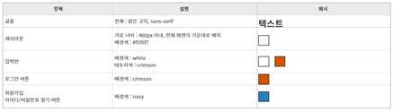
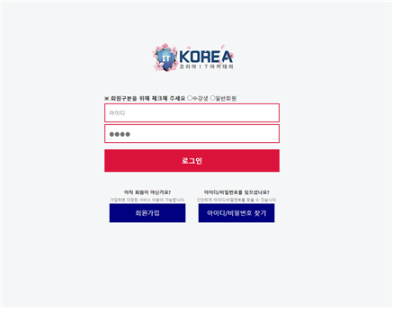
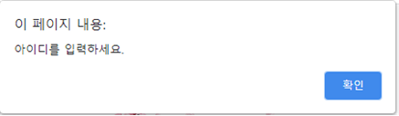
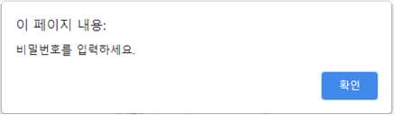
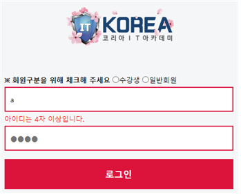
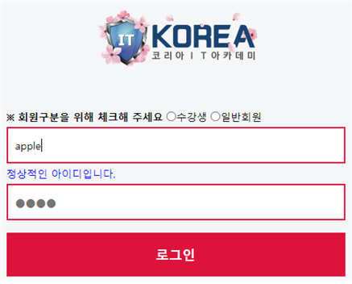

## 훈련과정명
- (스마트웹콘텐츠개발)AWS 클라우드를 활용한 풀스택 개발
## 교과목명
- UI/UX 엔지니어링
## 능력단위
- UI 구현

## 평가준거
### UI 설계 검토하기
- UI 제작을 위하여 GUI 디자인 가이드를 이해하고 이를 기반으로 구현 가능성 여부를 검토할 수 있다.
- 구현 환경에 따라서 구체적인 GUI 프로세스의 이해와 설계 변경 여부를 파악할 수 있다.
- UI 구현 표준 수립을 위하여 UI 검토 의견서를 작성할 수 있다.
### UI 구현 표준 검토하기
- 고객 요구사항, 접근성 기준, 플랫폼에 대한 UI 표준 관련 기준을 파악할 수 있다.
- 실제 페이지 제작을 위하여 아이콘, 레이아웃, 화면 개발 환경에 적합한 표준을 검토할 수 있다.
- UI 구현 표준을 이해관계자와 검토하여 최종 표준안에 반영할 수 있다.

## 채점 기준
```
1. 
<수행준거> 고객 요구사항, 접근성 기준, 플랫폼에 대한 UI 표준 관련 기준을 파악할 수 있다.

6점 : css 파일을 분할한 경우

3점 : style 태그를 사용한 경우

0점 : 작업을 수행하지 못한 경우

 

<수행준거> 실제 페이지 제작을 위하여 아이콘, 레이아웃, 화면 개발 환경에 적합한 표준을 검토할 수 있다.

24점 : 적절한 HTML 태그를 활용한 경우

16점 : 1~3개의 부적절한 태그를 활용한 경우

8점 : 4~6개의 부적절한 태그를 활용한 경우

0점 : 작업을 수행하지 못한 경우

 

<수행준거> UI 구현 표준을 이해관계자와 검토하여 최종 표준안에 반영할 수 있다.

40점 : UI 디자인 가이드와 제시화면에 따라 90% 이상 올바르게 CSS를 구현한 경우

32점 : UI 디자인 가이드와 제시화면에 따라 70% 이상 올바르게 CSS를 구현한 경우

24점 : UI 디자인 가이드와 제시화면에 따라 50% 이상 올바르게 CSS를 구현한 경우

16점 : UI 디자인 가이드와 제시화면에 따라 40% 이상 올바르게 CSS를 구현한 경우

8점 : UI 디자인 가이드와 제시화면에 따라 30% 이상 올바르게 CSS를 구현한 경우

0점 : 작업을 수행하지 못한 경우

2.

<수행준거> UI 제작을 위하여 GUI 디자인 가이드를 이해하고 이를 기반으로 구현 가능성 여부를 검토할 수 있다.

8점 : 아이디 입력에 따른 점검 결과 메시지가 정상적으로 출력되는 경우

4점 : 작업을 수행하였으나 정상적으로 메시지가 출력되지 않는 경우

0점 : 작업을 수행하지 못한 경우

 

<수행준거> 구현 환경에 따라서 구체적인 GUI 프로세스의 이해와 설계 변경 여부를 파악할 수 있다.

6점 : 제이쿼리 + login.js 작업을 수행한 경우

4점 : 제이쿼리 + login.js 작업 중 하나만 수행한 경우

2점 : 자바스크립트와 script 태그로 작업을 수행한 경우

0점 : 작업을 수행하지 못한 경우

 

<수행준거> UI 구현 표준 수립을 위하여 UI 검토 의견서를 작성할 수 있다.

16점 : submit 동작 시 경고창, 자동커서, submit 방지를 모두 올바르게 구현한 경우

12점 : submit 동작 시 경고창, 자동커서, submit 방지 중 2가지를 올바르게 구현한 경우

8점 : submit 동작 시 경고창, 자동커서, submit 방지 중 1가지를 올바르게 구현한 경우

4점 : 작업을 수행하였으나 모두 잘못 구현한 경우

0점 : 작업을 수행하지 못한 경우
```

## 1. 다음 UI 디자인 가이드를 참고하여 로그인 UI를 구현하시오 (70점)
- login.html로 작성하고 CSS작업은 login.css 파일에 별도로 작업하여 분리하시오
- 만약 login.css 파일로 분리가 안된다면 style 태그를 이용해서 작업을 수행하시오
```
- 가점 : login.css 분리
- 감점 : style 태그 작업
```
- 필요한 이미지는 아래 링크를 클릭하여 다운로드 받아서 사용하시오. 다운로드 받은 이미지 파일의 이름을 logo.png로 수정하고 login.html 파일과 동일한 디렉터리에 두고 사용하시오.

<<디자인 가이드>>



<<구현 결과 화면>>




## 2. 다음의 문제를 해결하시오(30점)
- 작성된 login.html 파일에 다음과 같이 동작할 수 있도록 필요한 코드를 자바스크립트나 제이쿼리로 작업하시오.
- 스크립트 작업은 login.js 파일에 별도로 작업하여 분리하시오.
- login.js 파일로 분리가 안된다면 script 태그를 이용해서 작업을 수행하시오.

```
- 가점 : 제이쿼리 사용, login.js 분리 작업

- 감점 : 자바스크립트 사용, script 태그 작업
```

1) 아이디나 비밀번호가 입력되지 않은 상태로 로그인 버튼을 클릭하여 submit을 요청하면 아래와 같은 경고 메시지를 출력하시오.<br>
경고 메시지 출력 후에는 입력되지 않은 입력 요소에 커서를 자동으로 옮기고 submit 되지 않도록 처리하시오.




2) 아이디와 비밀번호를 모두 입력한 상태로 로그인 버튼을 클릭하면 index.html로 submit 할 수 있도록 구현하시오.<br>index.html 파일을 생성할 필요는 없고, submit에 필요한 코드만 login.html에 작성하시오.

<br>


1) 아이디를 입력할때마다 입력된 아이디가 4글자 이상인지 점검한 결과를 나타내도록 구현하시오.

        (1) 4글자 미만인 경우 : "아이디는 4자 이상입니다.", 빨간색

        (2) 4글자 이상인 경우 : "정상적인 아이디입니다.", 파란색

<< 입력된 아이디가 4글자 미만인 경우 >>



<< 입력된 아이디가 4글자 이상인 경우 >>



### [답안 제출 방식] 
- 작업한 파일 4개(login.html + login.css + login.js + logo.png)를 모두 하나의 파일로 압축하여 제출하시오.


## 정답
- login.html
```html
<!DOCTYPE html>
<html lang="ko">
<head>
    <meta charset="UTF-8">
    <meta name="viewport" content="width=device-width, initial-scale=1.0">
    <title>로그인 페이지</title>
    <link rel="stylesheet" href="http://cdnjs.cloudflare.com/ajax/libs/font-awesome/4.7.0/css/font-awesome.min.css">
</head>
<body>
    <div class="container">
        <div id="index.html" class="logo"></div>
        <header>
            <section>
                <form id="login-form" method="post" action="index.html">
                    <div>
                        <input type="radio" name="userType" value="student" id="student">
                        <label for="student">학생</label>
                        <input type="radio" name="userType" value="member" id="member">
                        <label for="member">회원</label>
                    </div>
                    <div>
                        <input type="text" id="id" placeholder="아이디">
                        <label for="id">아이디</label>
                    </div>
                    <div>
                        <input type="password" id="password" placeholder="비밀번호">
                        <label for="password">비밀번호</label>
                    </div>
                    <button class="login-btn" type="submit">로그인</button>
                </form>
            </section>
        </header>
        <footer>
            <div class="find">
                <p class="footer-title">소중한 정보는 여기 있습니다.</p>
                <p>아이디/비밀번호를 잊으셨을 때는 아래의 링크를 사용하세요.</p>
                <a href="#" class="footer-link">아이디 찾기</a>
                <a href="#" class="footer-link">비밀번호 찾기</a>
            </div>
        </footer>
    </div>
</body>
</html>
```

- login.css
```css
/* 공통 스타일 설정 */
* {
    box-sizing: border-box;
    margin: 0;
    padding: 0;
    font-family: "맑은 고딕", sans-serif;
}

html {
    height: 100%;
}

body {
    height: 100%;
    background-color: #f5f6fa;
}

a {
    text-decoration: none;
    color: black;
}

.container {
    width: 100%;
    max-width: 500px;
    margin: 0 auto;
}

header {
    margin: 0 auto;
}

.logo {
    width: 100%;
    height: 80px;
    background: url("logo.png") no-repeat center;
    background-size: auto;
}

form {
    width: 100%;
    padding: 0 5%;
    padding-top: 16px;
}

button {
    width: 100%;
    height: 50px;
    background-color: crimson;
    font-size: 16px;
    font-weight: bold;
    color: white;
    text-align: center;
    text-transform: uppercase;
    border: none;
    border-radius: 4px;
}

footer {
    width: 100%;
    text-align: center;
    display: flex;
    justify-content: space-between;
}

footer a {
    display: block;
    margin-top: 20px;
    font-size: 14px;
    font-weight: bold;
    color: blue;
}

.id_init {
    display: none;
}

.id_fail {
    display: block;
    margin-top: 5px;
    font-size: 12px;
    color: red;
}

.id_success {
    display: block;
    margin-top: 5px;
    font-size: 12px;
    color: blue;
}

```
- login.js
```js
document.addEventListener("DOMContentLoaded", function () {
    const loginForm = document.getElementById("login-form");
    const idInput = document.getElementById("id");
    const pwInput = document.getElementById("pw");
    const idMsg = document.getElementById("id_msg");

    loginForm.addEventListener("submit", function (event) {
        if (idInput.value === "") {
            alert("아이디를 입력하세요.");
            idInput.focus();
            event.preventDefault();
            return false;
        } else if (pwInput.value === "") {
            alert("비밀번호를 입력하세요.");
            pwInput.focus();
            event.preventDefault();
            return false;
        }
    });

    idInput.addEventListener("keyup", function () {
        if (idInput.value.length === 0) {
            idMsg.classList.remove("id_success", "id_fail");
            idMsg.classList.add("id_init");
            idMsg.textContent = "아이디를 입력해주세요.";
        } else if (idInput.value.length < 4) {
            idMsg.textContent = "아이디는 4자 이상입니다.";
            idMsg.classList.remove("id_init", "id_success");
            idMsg.classList.add("id_fail");
        } else {
            idMsg.textContent = "정상적인 아이디입니다.";
            idMsg.classList.remove("id_init", "id_fail");
            idMsg.classList.add("id_success");
        }
    });
});
```