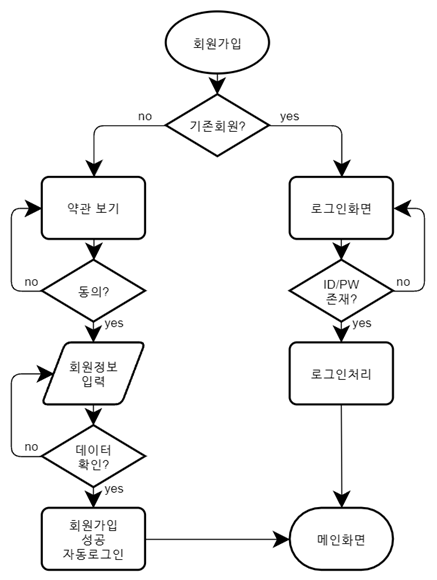

## 훈련과정명
- (스마트웹콘텐츠개발)AWS 클라우드를 활용한 풀스택 개발
## 교과목명
- UI/UX 엔지니어링
## 능력단위
- UI 아키텍처 설계

## 능력단위 요소
- 정보 설계하기
- 와이어프레임 작성하기
- 테스크 플로우 작성하기

## 평가준거
### 정보설계하기
- 결정된 콘텐츠와 기능에 따라서 정보 구조를 설계할 수 있다.
- 사용자가 사용하는 언어를 고려하여 메뉴 및 UI 구성요소에 대하여 레이블링(Labeling)할 수 있다.
- 사용자의 접근성, 사용성을 위하여 네비게이션(Navigation) 구조를 설계할 수 있다.
### 와이어프레임 작성하기
- 기획된 UI/UX 콘셉트에 따라서 화면의 기본 구조를 정의할 수 있다.
- 사용자 인터페이스 요소의 구성에 따라 모든 화면들을 간략하게 설계할 수 있다.
- UI 기술과 개발 난이도를 고려하여 요소별 액션을 정의할 수 있다.
### 테스크 플로우 작성하기
- 사용자가 이용하는 서비스에 대하여 경험 경로 및 과정을 예측할 수 있다.
- 모든 화면들이 시나리오 흐름과 옵션에 따라 어떤 경로를 갖게 되는지 작성 할 수 있다.
- 각 흐름에 따라서 태스크 플로우(Task Flow)를 작성할 수 있다.

## 채점 기준
```
<수행준거> 모든 화면들이 시나리오 흐름과 옵션에 따라 어떤 경로를 갖게 되는지 작성할 수 있다.

10점 - 선택에 따른 yes/no 설정을 모두 올바르게 작성한 경우

5점 - 선택에 따른 yes/no 설정을 1개 잘못 작성한 경우

1점 - 선택에 따른 yes/no 설정을 2개 이상 잘못 작성한 경우


<수행준거> 각 흐름에 따라서 태스크 플로우(Task Flow)를 작성할 수 있다.

20점 - 올바른 플로우 차트를 작성한 경우

10점 - 플로우 차트를 작성하였으나 잘못 처리한 단계가 2개 이하로 있는 경우

1점 - 잘못된 플로우 차트를 작성한 경우

<수행준거> 기획된 UI/UX 콘셉트에 따라서 화면의 기본 구조를 정의할 수 있다.

10점 - 전체 레이아웃을 적절하게 처리한 경우

5점 - 일부 레이아웃이 적절하지 않는 경우

1점 - 전체 레이아웃을 잘못 처리한 경우

 
<수행준거> 사용자 인터페이스 요소의 구성에 따라 모든 화면들을 간략하게 설계할 수 있다.

20점 - 모든 구성요소들을 배치한 경우

15점 - 대부분의 구성요소들을 배치하였으나 누락되거나 잘못 배치한 구성요소가 2개 이하로 존재하는 경우

10점 - 대부분의 구성요소들을 배치하였으나 누락되거나 잘못 배치한 구성요소가 4개 이하로 존재하는 경우

5점 - 대부분의 구성요소들을 배치하였으나 누락되거나 잘못 배치한 구성요소가 6개 이하로 존재하는 경우

1점 - 구성요소들을 잘못 배치한 경우


<수행준거> UI 기술과 개발 난이도를 고려하여 요소별 액션을 정의할 수 있다.

10점 - 모든 페이지의 링크 설정을 올바르게 처리한 경우

5점 - 링크 설정을 하였으나 누락되거나 잘못된 링크가 존재하는 경우

1점 - 모든 페이지의 링크 설정을 잘못 처리한 경우
```


## 1. 다음 흐름에 따라서 회원가입 과정과 로그인 과정을 나타내는 플로우 차트(flow chart)를 작성하시오.

● 회원가입 버튼을 클릭하면 기존 회원인지 여부를 판단하는 페이지로 이동하여 기존 회원인 경우 로그인 페이지로 이동하고 아닌 경우 약관 보기 페이지로 이동한다.

 <br>

● 로그인 페이지에서는 ID와 PW를 입력 받아 해당 회원이 존재하면 로그인처리를 수행하고 메인화면으로 이동한다. ID나 PW가 잘못된 회원인 경우에는 다시 로그인 페이지로 이동한다.

  <br>

● 약관에 동의한 경우 회원 정보를 입력 할 수 있는 회원가입 페이지로 이동한다. 약관에 동의하지 않은 경우 약관 보기 페이지에서 벗어나지 않는다.

  <br>

● 가입할 회원 정보를 입력하면 입력된 정보가 올바른 정보인지 확인하고 잘못된 정보가 입력된 경우 회원 정보를 다시 입력 받을 수 있도록 처리한다.

  <br>

● 회원가입에 성공하면 자동으로 로그인 된 뒤 메인화면으로 이동한다.

### [제출방식] 작성된 플로우 차트를 이미지로 캡쳐하여 답안에 붙여넣기 하시오.

### 해답



## 2. 작성된 플로우 차트를 기반으로 와이어프레임을 작성하시오.

```
● 가로 600px의 모바일 화면을 기준으로 작업하시오. 

 

● 시작 페이지

  임의의 이미지, 제목 "서울 농장에 오신 걸 환영합니다", 로그인 링크, 회원가입 링크

   

● 로그인 페이지

  제목 "서울 농장", 아이디 입력란, 비밀번호 입력란, 로그인 버튼, 아이디 찾기 / 비밀번호 찾기 링크

 

● 가입여부 확인 페이지

  제목 "서울 농장 서비스 사용을 위해서 가입 여부를 확인합니다", 성명 입력란, 연락처 입력란, 가입여부 확인 버튼

 

● 약관 페이지

  제목 "약관", 전체 동의 체크 상자, 개인정보 보호 정책(필수) 내용 및 동의/동의 안 함 라디오 버튼, 이벤트 정책(선택) 내용 및 동의/동의 안 함 라디오 버튼, 동의 안 함 버튼, 동의함 버튼

 

● 회원가입 페이지

  제목 "회원가입", 아이디 입력란, 비밀번호 입력란, 비밀번호 확인란, 연락처 입력란, 회원가입하기 버튼
```
 
### [제출방식] 작업이 끝난 와이어프레임을 웹 테스트로 확인한 뒤 해당 경로(주소)를 붙여넣기 하여 답안을 제출하시오. 와이어프레임 자체를 캡쳐하여 제출하지 마시오.