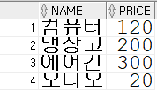

## 1. 아래 칼럼을 가지는 PRODUCT 테이블을 생성하는 DDL 을 작성하시오.
```
제약조건의 이름은 자동으로 부여되도록 별도로 지정하지 마시오. (단, 제약조건의 이름을 지정하더라도 감점하지 않는다.) (10점)

<< 칼럼 정보 >>

1) NO : 제품번호, 숫자, 기본키

2) NAME : 제품명, 문자열 최대 100바이트, 필수

3) PRICE : 제품가격, 숫자

4) P_DATE : 생산일자, 날짜
```

### 정답
```sql
CREATE TABLE PRODUCT(
NO NUMBER PRIMARY KEY,
NAME VARCHAR2(100) NOT NULL,
PRICE NUMBER,
P_DATE DATE
);
```

# 2. PRODUCT테이블에서 NO 칼럼에 활용할 시퀀스를 작성하시오.
- 시퀀스의 이름과 속성은 알아서 처리하시오
- 증가량은 1이다.
- 시작값은 1000이다
- 캐시를 사용하지 않는다.

### 정답
```SQL
CREATE SEQUENCE PRODUCT_SEQ
INCREMENT BY 1
START WITH 1000
NOCACHE;
```

# 3. PRODUCT 테이블에서 다음 조건을 만족하는 데이터의 정보를 수정하시오.
```
<< 조건 >>

NO 가 1000 인 데이터의 PRICE 를 20만큼 증가시키시오.
```

### 정답
```sql
UPDATE PRODUCT SET
PRICE = PRICE + 20
WHERE NO = 1000;
```

## 4. PRODUCT 테이블에서 다음 조건을 만족하는 데이터를 삭제하시오.
```
<< 조건 >>

NAME 이 '세탁기' 인 데이터를 모두 삭제하시오.
```

### 정답
```SQL
DELETE FROM PRODUCT
WHERE NAME = '세탁기';
```

## 5. PRODUCT 테이블에서 다음과 같이 데이터를 조회하시오.



### 정답
```sql
SELECT NAME, PRICE
FROM PRODUCT
```

# 6. 테이블에 삽입, 수정, 삭제된 내용을 실제로 DB에 반영하는 쿼리문을 작성하시오.
### 정답
```SQL
COMMIT;
```
# 7. 테이블에 삽입, 수정, 삭제된 내용을 취소하는 쿼리문을 작성하시오.
### 정답
```SQL
ROLLBACK;
```


