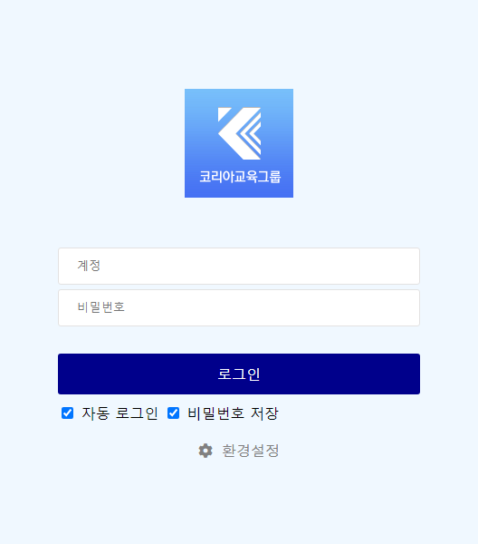
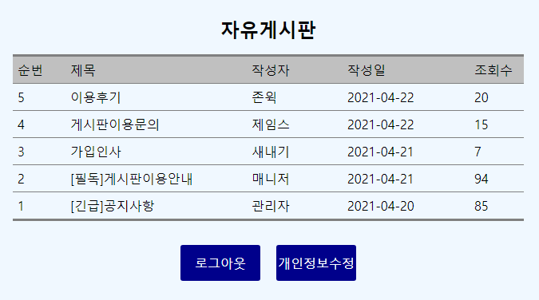
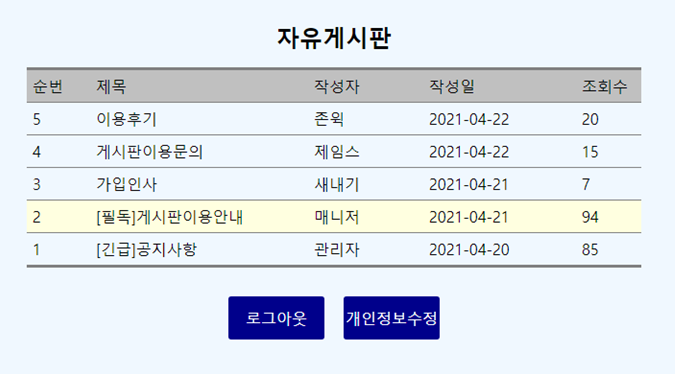
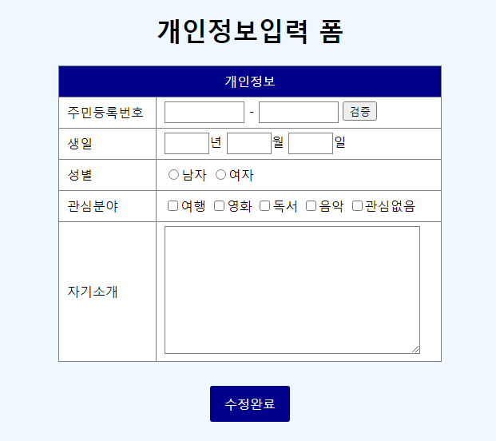
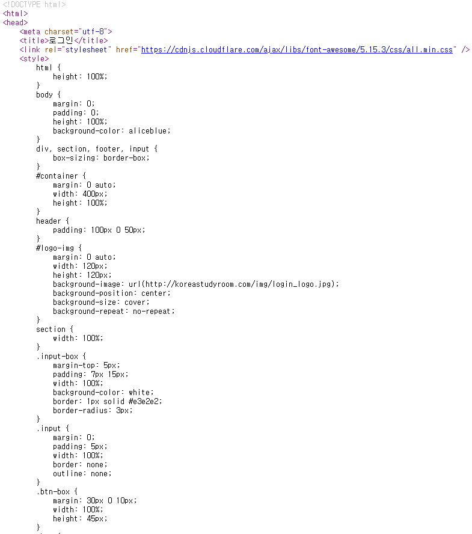
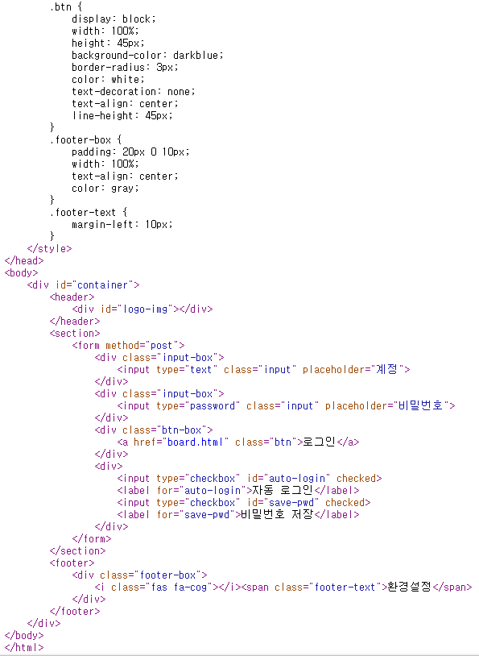
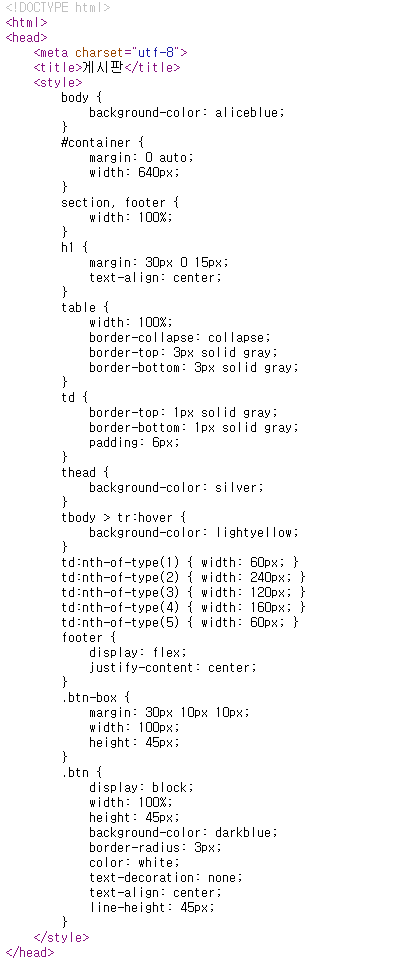
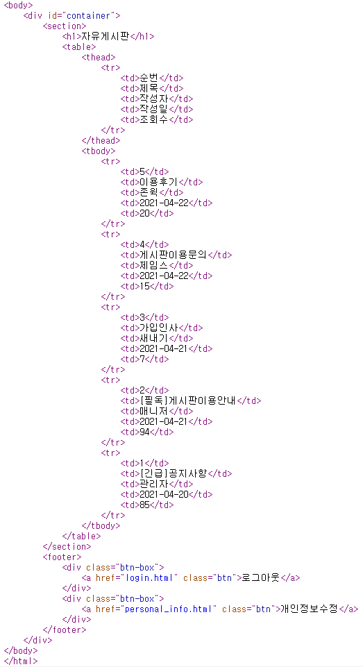
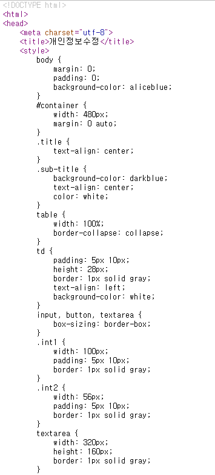
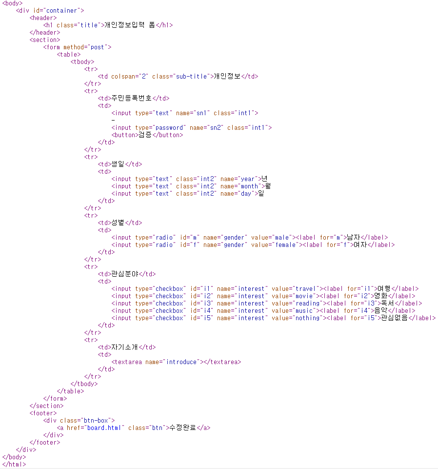

## 1.  UI 설계를 확인하기 위해서 아래에 제시한 내용 중에서 잘못된 검토 내용 2가지를 찾아 그 번호를 작성하시오.
- 잘못된 이유를 작성할 필요는 없다.

```
    1) UI가 디자이너 측면에서 설계되고 디자이너 편리성이 반영되었는가?

    2) 화면 이동이 쉽게 설계되었는가?

    3) 사용자가 요구하는 내용을 직관적으로 파악할 수 있도록 되어 있는가?

    4) 논리적인 메뉴 구조를 갖추고 있으며 메뉴의 의미 전달이 정확하게 되어 있는가?

    5) 화면에 표시할 정보, 화면 구성, 화면 간 흐름 등에 대한 표시가 잘 나타나 있는가?

    6) 로그인/로그아웃 버튼이 개성있는 자리에 위치에 자리하고 있는가?
```
### 정답
```
1 , 6 
```


## 2. 아래의 조건을 만족하는 키워드를 작성하세요
```
<< 조건 >>

아이디와 비밀번호를 입력하는 입력 태그(input)에 값이 입력되어야만 폼의 데이터를 전송(submit)할 수 있도록 처리하려면 해당 input 태그에 어떤 속성(attribute)을 부여해야 하는가?
```

### 정답
- required

## 3. 아래 문제를 읽고 웹 표준을 준수하는 페이지를 구현하시오. (80점)
1. login.html
   - 화면과 최대한 유사한 형태로 작업하시오.
   - 로고 이미지는 동일하지 않은 임의의 이미지를 사용해도 무방하다.
   - 로그인 버튼을 클릭하면 계정과 비밀번호의 입력 여부와 상관 없이 board.html 페이지로 이동하시오.
     

2. board.html
   - 화면과 최대한 유사한 형태로 작업하시오.
   - 로그아웃 버튼을 클릭하면 login.html 페이지로 이동하시오.
   - 개인정보수정 버튼을 클릭하면 personal_info.html 페이지로 이동하시오.
   - 각 행에 마우스를 가져가면 행 배경색이 변경되도록 작업하시오.
    

    

3. personal_info.html
   - 화면과 최대한 유사한 형태로 작업하시오.
   - 수정완료 버튼을 클릭하면 board.html 페이지로 이동하시오.
    

### 제출방법
- 작성된 파일을 하나로 압축하여 업로드하시오

### 정답
1. login.html




2. board.html




3. personal_info.html




