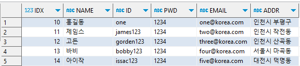
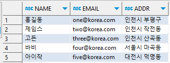

## 1. 아래 칼럼을 가지는 MEMBER 테이블을 생성하는 DDL 을 작성하시오.
```
제약조건의 이름은 자동으로 부여되도록 별도로 지정하지 마시오. (단, 제약조건의 이름을 지정하더라도 감점하지 않는다.) (10점)

<< 칼럼 정보 >>

1) IDX : 회원번호, 숫자, 기본키

2) NAME : 회원명, 문자열 최대 100바이트, NULL값 비허용

3) ID : id, 문자열 최대 100바이트 ,  NULL값 비허용, 중복비허용

4) PWD : 비밀번호, 문자열 최대 30바이트, NULL값 비허용

5) EMAIL : 이메일, 문자열 최대 50바이트, 중복비허용

6) ADDR : 주소, 문자열 최대 80바이트, NULL값 비허용
```

### 정답
```sql
--회원테이블
create table member(
	idx int primary key,               --일련번호
	name varchar2(100) not null,       --이름
	id varchar2(100) not null unique,  --아이디(중복방지 unique)
	pwd varchar2(100) not null,        --패스워드
	email varchar2(100) unique,        --이메일
	addr varchar2(100) not null
);
```

# 2. MEMBER테이블에서 IDX 칼럼에 활용할 시퀀스를 작성하시오.
- 시퀀스의 이름 : SEQ_MEMBER_IDX;
- 증가량은 1이다.
- 시작값은 10이다
- 캐시를 사용하지 않는다.

### 정답
```SQL
CREATE SEQUENCE SEQ_MEMBER_IDX
INCREMENT BY 1
START WITH 10
NOCACHE;
```

# 3. MEMBER 테이블에 아래의 데이터를 삽입하는 코드를 작성하시오.
- IDX 칼럼의 데이터는 SEQ_MEMBER_IDX 오라클 시퀀스를 활용하여 입력하시오.



### 정답
```SQL
insert into member values( seq_member_idx.nextVal,'홍길동', 'one','1234','one@korea.com','인천시 부평구');
insert into member values( seq_member_idx.nextVal,'제임스', 'james123','1234','two@korea.com','인천시 작전동');
insert into member values( seq_member_idx.nextVal,'고든', 'gorden123','1234','three@korea.com','인천시 산곡동');
insert into member values( seq_member_idx.nextVal,'바비', 'bobby123','1234', 'four@korea.com','서울시 마곡동');
insert into member values( seq_member_idx.nextVal,'아이작', 'issac123','1234','five@korea.com','대전시 덕명동');
```

# 4. MEMBER 테이블에서 다음 조건을 만족하는 데이터의 정보를 수정하시오.
### 조건
- IDX가 12번인 회원의 이름을 제임스로 수정하시오

### 정답
```sql
UPDATE MEMBER SET
NAME = '스미스'
WHERE IDX = 12;
```

# 5. MEMBER 테이블에서 다음 조건을 만족하는 데이터를 삭제하시오.
### 조건
- NAME 이 '아이작' 인 데이터를 모두 삭제하시오.

### 정답
```SQL
DELETE FROM MEMBER
WHERE NAME = '아이작';
```

# 6. MEMBER 테이블에서 다음과 같이 데이터를 조회하시오.



### 정답
```sql
SELECT NAME,EMAIL,ADDR FROM "MEMBER";
```

# 7. MEMBER테이블에서 다음 조건을 만족하는 데이터를 조회하시오.
### 조건
- 모든 레코드와 칼럼을 IDX가 높은순으로 정렬하여 조회하시오

### 정답
```SQL
SELECT * FROM MEMBER ORDER BY IDX DESC;
```

# 8. MEMBER 테이블에서 다음 조건을 만족하는 데이터를 조회하시오.
### 조건
- 인천의 사는 사람이 몇명인지 조회하는 코드를 작성하세요

## 정답
```SQL
SELECT COUNT(*) FROM "MEMBER" WHERE ADDR LIKE '%인천시%';
```


# 9. 테이블에 삽입, 수정, 삭제된 내용을 실제로 DB에 반영하는 키워드를 작성하시오.
### 정답
```SQL
COMMIT;
```
# 10. 테이블에 삽입, 수정, 삭제된 내용을 취소하는 키워드를 작성하시오.
### 정답
```SQL
ROLLBACK;
```


