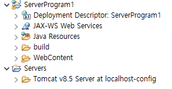
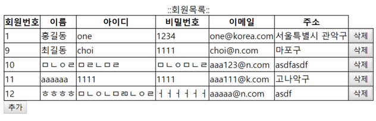

# 1. 다음 지시사항에 따라 회원관리 서버프로그램을 구현하시오.(10점)
- 프로젝트명 : ServerProgram1
- 통합개발환경 : eclipse
- WAS : tomcat

### 답안제출방식
- 프로젝트를 추가한 eclipse화면을 캡쳐하여 제출하시오.


### 정답


## 2. 웹페이지에서 사용할 공통 모듈들을 구현하시오(40점)

- 테이블 생성및 SQL문은 아래와 같이 제공됩니다.
```sql
--일련번호 관리객체
create sequence seq_member_idx;

--회원테이블
create table member(
	idx int primary key,               --일련번호
	name varchar2(100) not null,       --이름
	id varchar2(100) not null unique,  --아이디(중복방지 unique)
	pwd varchar2(100) not null,        --패스워드
	email varchar2(100) unique,        --이메일
	addr varchar2(100) not null
);

--샘플 데이터 추가
insert into member values( seq_member_idx.nextVal,
				 '홍길동', 
				 'one',
				 '1234',
				 'one@korea.com',
				 '인천시 부평구'
				 );

--커밋
commit;
```

1. dto패키지를 만들고 MEMBER 테이블의 정보를 전달할 때 사용하는 MemberDTO클래스를 구현하시오.

### 정답

```java
/***** MemberDTO.java *****/
package dto;

public class MemberDTO {

	//회원관리객체
	int idx;//일련번호
	String name;//이름
	String id;//아이디
	String pwd;//패스워드
	String email;//이메일
	String addr;//주소
	
	public int getIdx() {
		return idx;
	}
	public void setIdx(int idx) {
		this.idx = idx;
	}
	public String getName() {
		return name;
	}
	public void setName(String name) {
		this.name = name;
	}
	public String getId() {
		return id;
	}
	public void setId(String id) {
		this.id = id;
	}
	public String getPwd() {
		return pwd;
	}
	public void setPwd(String pwd) {
		this.pwd = pwd;
	}
	public String getEmail() {
		return email;
	}
	public void setEmail(String email) {
		this.email = email;
	}

	public String getAddr(){
		return email;
	}

	public void setAddr(String addr){
		this.addr = addr;
	}
}

```

2. db.util 패키지를 만들고 DB설정을 저장하는 DBConfig 인터페이스와 DB접속과 해제를 담당하는 DBConnector 클래스를 구현하시오.

#### DBConnector 클래스는 싱글톤으로 구현하시오

(1) jdbc 드라이버 : oracle.jdbc.driver.OracleDriver

(2) URL : jdbc:oracle:thin:@localhost:1521:xe

(3) USER : hr

(4) PASSWORD : hr

### 정답
```java
/***** DBConfig.java *****/
package db.util;

public interface DBConfig {
	public final String driver = "oracle.jdbc.OracleDriver";
	public final String url = "jdbc:oracle:thin:@localhost:1521:xe";
	public final String user = "hr";
	public final String password = "hr";
}


/***** DBConnector.java *****/
package db.util;

import java.sql.Connection;
import java.sql.DriverManager;
import java.sql.PreparedStatement;
import java.sql.ResultSet;

public class DBConnector {

	private static DBConnector instance = new DBConnector();
	private Connection con;
	private DBConnector() {
		try {
			Class.forName(DBConfig.driver);
			con = DriverManager.getConnection(DBConfig.url,DBConfig.user, DBConfig.password);
		} catch (Exception e) {
			// TODO: handle exception
		}
	}
	
	public static DBConnector getInstance() {
		if(instance == null) {
			instance = new DBConnector();
		}
		return instance;
	}
	
	public Connection getConnection() {
		return con;
	}
	
	public void close(PreparedStatement ps, ResultSet rs) {
		try {
			if(ps != null) {
				ps.close();
			}
			
			if(rs != null) {
				rs.close();
			}
		} catch (Exception e) {
			// TODO: handle exception
		}
	}
}

```


3. dao패키지를 만들고 DB 처리를 담당하는 MemberDAO 클래스를 싱글톤으로 구현하시오

```java
/***** MemberDAO.java *****/
package dao;

import java.sql.Connection;
import java.sql.PreparedStatement;
import java.sql.ResultSet;
import java.sql.SQLException;
import java.util.ArrayList;
import java.util.List;

import db.util.DBConnector;
import dto.MemberDTO;

public class MemberDAO {
	// single-ton pattern: 
	// 객체1개만생성해서 지속적으로 서비스하자
	static MemberDAO single = null;

	//_singleton 템플릿
	public static MemberDAO getInstance() {
		//생성되지 않았으면 생성
		if (single == null)
			single = new MemberDAO();
		//생성된 객체정보를 반환
		return single;
	}
}
```


1. controller패키지를 만들고 MemberController 서블릿을 구현하시오. URL매핑값으로 member_list를 사용하시오.

```java
package controller;

import java.io.IOException;

import javax.servlet.ServletException;
import javax.servlet.annotation.WebServlet;
import javax.servlet.http.HttpServlet;
import javax.servlet.http.HttpServletRequest;
import javax.servlet.http.HttpServletResponse;

import dao.MemberDAO;

@WebServlet("member_list")
public class MemberController extends HttpServlet {

	
	@Override
	protected void service(HttpServletRequest req, HttpServletResponse resp) throws ServletException, IOException {
		MemberDAO dao = MemberDAO.getInstance();
		
		req.getRequestDispatcher("member_list.jsp").forward(req, resp);
	}
}
```

## 3. 회원목록을 다음과 같이 출력하시오



### 정답
```java
/***** MemberDAO.java *****/
package dao;

import java.sql.Connection;
import java.sql.PreparedStatement;
import java.sql.ResultSet;
import java.sql.SQLException;
import java.util.ArrayList;
import java.util.List;

import db.util.DBConnector;
import dto.MemberDTO;

public class MemberDAO {
	// single-ton pattern: 
	// 객체1개만생성해서 지속적으로 서비스하자
	static MemberDAO single = null;

	//_singleton 템플릿
	public static MemberDAO getInstance() {
		//생성되지 않았으면 생성
		if (single == null)
			single = new MemberDAO();
		//생성된 객체정보를 반환
		return single;
	}
	
	public List<MemberDTO> selectList(){
		Connection conn = null;
		PreparedStatement pstmt = null;
		ResultSet rs = null;
		
		List<MemberDTO> list = new ArrayList<>();
		
		String sql="select * from member";
		
		try {
			conn = DBConnector.getInstance().getConnection();
			pstmt = conn.prepareStatement(sql);
			rs = pstmt.executeQuery();
			
			while(rs.next()) {
				MemberDTO dto = new MemberDTO();
				dto.setIdx(rs.getInt("idx"));
				dto.setId(rs.getString("id"));
				dto.setName(rs.getString("name"));
				dto.setPwd(rs.getString("pwd"));
				dto.setEmail(rs.getString("email"));
				dto.setAddr(rs.getString("addr"));
				
				list.add(dto);
			}
		} catch (Exception e) {
			// TODO: handle exception
		}
		
		return list;
	}	
}

/**** MemberController ****/
package controller;

import java.io.IOException;
import java.util.List;

import javax.servlet.ServletException;
import javax.servlet.annotation.WebServlet;
import javax.servlet.http.HttpServlet;
import javax.servlet.http.HttpServletRequest;
import javax.servlet.http.HttpServletResponse;

import dao.MemberDAO;
import dto.MemberDTO;

@WebServlet("member_list")
public class MemberController extends HttpServlet {

	
	@Override
	protected void service(HttpServletRequest req, HttpServletResponse resp) throws ServletException, IOException {
		MemberDAO dao = MemberDAO.getInstance();
		
		List<MemberDTO> list = dao.selectList();
		
		req.setAttribute("list", list);
		
		req.getRequestDispatcher("member_list.jsp").forward(req, resp);
	}
}

/**** member_list.jsp ****/

<% 
	//회원목록 가져오기
	List<MemberVO> member_list =MemberDAO.getInstance().dao.selectList();
%>

<html>
<head>

<meta http-equiv="Content-Type" content="text/html; charset=UTF-8">
<title>Insert title here</title>

	<style>
		table{border:1px solid black;
		      border-collapse:collapse;}
	</style>

</head>

<body>
	<table border="1">		
		<caption>::회원목록::</caption>
		
		<tr>
			<th>회원번호</th>
			<th>이름</th>
			<th>아이디</th>
			<th>비밀번호</th>
			<th>이메일</th>
			<th>주소</th>
			<th>비고</th>
		</tr>
		
		<% 
		for(int i = 0; i < member_list.size(); i++){ 
			MemberVO vo = member_list.get(i);
		%>
		
		<tr>
			<td><%= vo.getIdx()%></td>
			<td><%= vo.getName()%></td>
			<td><%= vo.getId()%></td>
			<td><%= vo.getPwd()%></td>
			<td><%= vo.getEmail()%></td>
			<td><%= vo.getAddr()%></td>
			
			
			<td>
				<input type=button value="삭제" onclick="del('<%= vo.getIdx() %>')"/>
			</td>
		</tr>
		
		<% }%>
	</table>
	
		<input type="button" value="추가" onclick="location.href='member_register_form.jsp';">	
	
</body>

</html>

```


