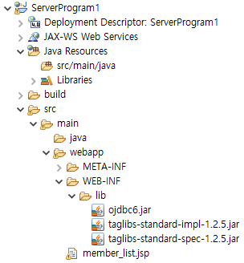

# 1. 다음 지시사항에 따라 회원관리 서버프로그램을 구현하시오.
- 프로젝트명 : ServerProgram1
- 통합개발환경 : eclipse
- WAS : tomcat

### 답안제출방식
- 프로젝트를 추가한 eclipse화면을 캡쳐하여 제출하시오.


### 정답


## 2. 웹페이지에서 사용할 공통 모듈들을 구현하시오

- 테이블 생성및 SQL문은 아래와 같이 제공됩니다.
```sql
-- 시퀀스 생성하기
CREATE SEQUENCE MEMBER_SEQ;

CREATE TABLE MEMBER_TABLE(
	NO NUMBER,
	ID VARCHAR2(50),
	NAME VARCHAR2(50),
	GRADE VARCHAR2(50),
	POINT NUMBER
);

INSERT INTO MEMBER_TABLE VALUES(MEMBER_SEQ.NEXTVAL,'jack','잭','vip',5000);
INSERT INTO MEMBER_TABLE VALUES(MEMBER_SEQ.NEXTVAL,'scott','스캇','gold',4000);
INSERT INTO MEMBER_TABLE VALUES(MEMBER_SEQ.NEXTVAL,'wolf','울프','bronze',1000);
INSERT INTO MEMBER_TABLE VALUES(MEMBER_SEQ.NEXTVAL,'eagle','이글','silver',3500);
INSERT INTO MEMBER_TABLE VALUES(MEMBER_SEQ.NEXTVAL,'prodo','프로도','gold',4500);

-- selectAll
SELECT NO, ID, NAME, GRADE, POINT FROM MEMBER_TABLE;

-- login
SELECT NO, ID, NAME, GRADE, POINT FROM MEMBER_TABLE WHERE ID= ? AND NAME=?;

-- deleteMember
DELETE FROM MEMBER_TABLE WHERE NO=?;

-- updateMember
UPDATE MEMBER_TABLE SET NAME= ?, POINT = ? GRADE = ? WHERE NO = ?;

-- updatePoint
UPDATE MEMBER_TABLE SET POINT = POINT + 10;
```

1. dto패키지를 만들고 MEMBER_TABLE 테이블의 정보를 전달할 때 사용하는 MemberDTO클래스를 구현하시오.

### 정답

```java
/***** MemberDTO.java *****/
package dto;

public class MemberDTO {
    private int no;
    private String id;
    private String name;
    private String grade;
    private int point;

    // Getter 및 Setter 메서드
    public int getNo() {
        return no;
    }

    public void setNo(int no) {
        this.no = no;
    }

    public String getId() {
        return id;
    }

    public void setId(String id) {
        this.id = id;
    }

    public String getName() {
        return name;
    }

    public void setName(String name) {
        this.name = name;
    }

    public String getGrade() {
        return grade;
    }

    public void setGrade(String grade) {
        this.grade = grade;
    }

    public int getPoint() {
        return point;
    }

    public void setPoint(int point) {
        this.point = point;
    }
}
```

2. db.util 패키지를 만들고 DB설정을 저장하는 DBConfig 인터페이스와 DB접속과 해제를 담당하는 DBConnector 클래스를 구현하시오.

#### DBConnector 클래스는 싱글톤으로 구현하시오

(1) jdbc 드라이버 : oracle.jdbc.driver.OracleDriver

(2) URL : jdbc:oracle:thin:@localhost:1521:xe

(3) USER : hr

(4) PASSWORD : hr

### 정답
```java
/***** DBConfig.java *****/
package db.util;

public interface DBConfig {
	public final String driver = "oracle.jdbc.OracleDriver";
	public final String url = "jdbc:oracle:thin:@localhost:1521:xe";
	public final String user = "hr";
	public final String password = "hr";
}


/***** DBConnector.java *****/
package db.util;

import java.sql.Connection;
import java.sql.DriverManager;
import java.sql.PreparedStatement;
import java.sql.ResultSet;

public class DBConnector {

	private static DBConnector instance = new DBConnector();
	private Connection con;
	private DBConnector() {
		try {
			Class.forName(DBConfig.driver);
			con = DriverManager.getConnection(DBConfig.url,DBConfig.user, DBConfig.password);
		} catch (Exception e) {
			// TODO: handle exception
		}
	}
	
	public static DBConnector getInstance() {
		if(instance == null) {
			instance = new DBConnector();
		}
		return instance;
	}
	
	public Connection getConnection() {
		return con;
	}
	
	public void close(PreparedStatement ps, ResultSet rs) {
		try {
			if(ps != null) {
				ps.close();
			}
			
			if(rs != null) {
				rs.close();
			}
		} catch (Exception e) {
			// TODO: handle exception
		}
	}
}

```


3. dao패키지를 만들고 DB 처리를 담당하는 MemberDAO 클래스를 싱글톤으로 구현하시오

```java
/***** MemberDAO.java *****/
package dao;

import java.sql.Connection;
import java.sql.PreparedStatement;
import java.sql.ResultSet;
import java.util.ArrayList;
import java.util.List;

import db.util.DBConnector;
import dto.MemberDTO;

public class MemberDAO {

	Connection con = null;
	PreparedStatement ps = null;
	ResultSet rs = null;
	String sql = null;
	
	private static MemberDAO instance = new MemberDAO();
	private MemberDAO() {
		con = DBConnector.getInstance().getConnection();
	}
	
	public static MemberDAO getInstance() {
		if(instance == null) {
			instance = new MemberDAO();
		}
		return instance;
	}
	
	public List<MemberDTO> selectAll(){
		List<MemberDTO> list = new ArrayList<MemberDTO>();
		try {
			sql = "SELECT NO, ID, NAME, GRADE, POINT FROM MEMBER_TABLE";
			ps = con.prepareStatement(sql);
			rs = ps.executeQuery();
			while(rs.next()) {
				MemberDTO dto = new MemberDTO();
				dto.setNo(rs.getInt("no"));
				dto.setId(rs.getString("id"));
				dto.setName(rs.getString("name"));
				dto.setGrade(rs.getString("grade"));
				dto.setPoint(rs.getInt("point"));
				list.add(dto);
			}
		} catch (Exception e) {
			// TODO: handle exception
		} finally {
			DBConnector.getInstance().close(ps, rs);
		}
		return list;
	}
}
```

4. model패키지에 응답View와 이동방식(redirect, forward)을 저장할 때 사용하는 ModelAndView클래스를 구현하시오

```java
/***** MemberDAO.java *****/
package model;

public class ModelAndView {

	private String view;
	private boolean isRedirect;
	
	public ModelAndView() {
		// TODO Auto-generated constructor stub
	}
	
	public ModelAndView(String view, boolean isRedirect) {
		super();
		this.view = view;
		this.isRedirect = isRedirect;
	}
	
	public String getView() {
		return view;
	}
	
	public void setView(String view) {
		this.view = view;
	}
	
	public boolean isRedirect() {
		return isRedirect;
	}
	
	public void setRedirect(boolean isRedirect) {
		this.isRedirect = isRedirect;
	}
}

```

5. service 패키지에 모든 비즈니스 로직을 담당할 Service들의 인터페이스인 MemberService 인터페이스를 생성하고 아래와 같은 추상메서드를 작성하시오

(1) 반환타입 : ModelAndView

(2) 메서드명 : execute

(3) 매개변수 : request와 response

```java
/***** MemberService.java *****/
package service;

import javax.servlet.http.HttpServletRequest;
import javax.servlet.http.HttpServletResponse;

import model.ModelAndView;

public interface MemberService {

	public ModelAndView execute(HttpServletRequest request, HttpServletResponse response);
}

/***** MemberListService.java *****/
package service;

import java.util.List;

import javax.servlet.http.HttpServletRequest;
import javax.servlet.http.HttpServletResponse;

import dao.MemberDAO;
import dto.MemberDTO;
import model.ModelAndView;

public class MemberListService implements MemberService{

	@Override
	public ModelAndView execute(HttpServletRequest request, HttpServletResponse response) {
		List<MemberDTO> list = MemberDAO.getInstance().selectAll();
		return new ModelAndView("list.jsp",false);
	}

}
```

6. 요청에 따라서 Service를 선택하는 ServiceMapper 클래스를 싱글톤으로 구현하시오.

```java
/***** ServiceMapper.java *****/
package controller;

import service.MemberListService;
import service.MemberService;

public class ServiceMapper {

	private static ServiceMapper instance = new ServiceMapper();
	private ServiceMapper() {};
	public static ServiceMapper getInstance() {
		if(instance == null) {
			instance = new ServiceMapper();
		}
		return instance;
	}
	
	public MemberService getService(String command) {
		MemberService service = null;
		switch(command) {
		case "list.do":
			service = new MemberListService();
			break;
		case "loginPage.do":
			service = new LoginPageService();
			break;
		case "login.do":
			service = new LoginService();
			break;
		case "logout.do":
			service = new LogoutService();
			break;
		case "joinPage.do":
			service = new JoinPageService();
			break;
		case "join.do":
			service = new JoinService();
			break;
		case "update.do":
			service = new UpdateService();
			break;
		case "delete.do":
			service = new LeaveService();
			break;
		}
		return service;
	}
	
}

```
7. 요청을 확인한 뒤 ServiceMapper가 선택한 Service의 실행 결과에 따라 페이지를 이동하는 MemberController 서블릿을 구현하시오. URL매핑값으로 *.do를 사용하시오.

```java
package controller;

import java.io.IOException;

import javax.servlet.ServletException;
import javax.servlet.annotation.WebServlet;
import javax.servlet.http.HttpServlet;
import javax.servlet.http.HttpServletRequest;
import javax.servlet.http.HttpServletResponse;

import model.ModelAndView;
import service.MemberService;

@WebServlet("*.do")
public class MemberController extends HttpServlet {

	public MemberController() {
		super();
	}
	
	@Override
	protected void service(HttpServletRequest request, HttpServletResponse response) throws ServletException, IOException {
		response.setContentType("text/html; charset=UTF-8");
		request.setCharacterEncoding("utf-8");
		String[] arr = request.getRequestURI().split("/");
		String command = arr[arr.length-1];
		MemberService service = ServiceMapper.getInstance().getService(command);
		ModelAndView mav = null;
		if(service != null) {
			mav = service.execute(request, response);
		}
		
		if(mav == null) {
			return;
		}
		
		if(mav.isRedirect()) {
			response.sendRedirect(mav.getView());
		} else {
			request.getRequestDispatcher(mav.getView()).forward(request, response);
		}
	}
}

```


