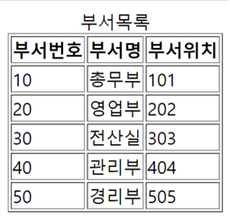

# 부서테이블을 조회하여 jsp로 출력하세요



## 테이블
```sql
CREATE TABLE DEPT(
  DEPTNO NUMBER(3) PRIMARY KEY,
  DNAME VARCHAR2(10),
  LOC VARCHAR2(5)
);

INSERT INTO DEPT VALUES(10, '총무부','101');
INSERT INTO DEPT VALUES(20, '영업부','202');
INSERT INTO DEPT VALUES(30, '전산실','303');
INSERT INTO DEPT VALUES(40, '관리부','404');
INSERT INTO DEPT VALUES(50, '경리부','505');
````

## 1. DeptProgram프로젝트를 만들고 캡쳐하여 제출하세요
- jstl을 사용하기 위한 라이브러리를 넣으세요
  - taglibs-standard-impl-1.2.5.jar, taglibs-standard-spec-1.2.5.jar
- 오라클을 연결하기 위한 라이브러리를 넣으세요
  - ojdbc6.jar
 
## 2. db.util 패키지를 만들고 다음의 파일을 만드세요
- DB설정을 저장하는 DBConfig 인터페이스
  - jdbc 드라이버 : oracle.jdbc.driver.OracleDriver
  - URL : jdbc:oracle:thin:@localhost:1521:xe
  - USER : hr
  - PASSWORD : hr
- DB접속과 해제를 담당하는 DBConnector 클래스

### 계정과 비밀번호는 다른걸 사용해도 감점하지 않습니다.
### DBConnector는 클래스는 싱글톤으로 구현하세요
<br>

### 정답 
```java
/***** DBConfig.java *****/
package db.util;

public interface DBConfig {
	public final String driver = "oracle.jdbc.driver.OracleDriver";
	public final String url = "jdbc:oracle:thin:@localhost:1521:xe";
	public final String user = "hr";
	public final String password = "hr";
}

/***** DBConnector.java *****/
package db.util;

import java.sql.Connection;
import java.sql.DriverManager;
import java.sql.PreparedStatement;
import java.sql.ResultSet;
import java.sql.SQLException;

public class DBConnector {

	private static DBConnector instance = new DBConnector();
	private Connection con;
	private DBConnector() {
		try {
			Class.forName(DBConfig.driver);
			con = DriverManager.getConnection(DBConfig.url,DBConfig.user, DBConfig.password);
			
			System.out.println("[Database 연결 성공]");
			
		} catch (SQLException e) {
			System.out.println("[SQL Error : " + e.getMessage() +"]");
		} catch (ClassNotFoundException e1) {

            System.out.println("[JDBC Connector Driver Error : " + e1.getMessage() + "]");
        }

	}
	
	public static DBConnector getInstance() {
		if(instance == null) {
			instance = new DBConnector();
		}
		return instance;
	}
	
	public Connection getConnection() {
		return con;
	}
	
	public void close(PreparedStatement ps, ResultSet rs) {
		try {
			if(ps != null) {
				ps.close();
			}
			
			if(rs != null) {
				rs.close();
			}
		} catch (Exception e) {
			// TODO: handle exception
		}
	}
}
```

## 3. dto 패키지를 만들고 DeptDTO.java를 만드세요
- 테이블에서 가져온 데이터를 담기위한 코드를 작성하세요

```java
package dto;

public class DeptDTO {

	//테이블의 컬럼이름과 되도록이면 같은 이름으로 만들자.
	private int deptno;
	private String dname;
	private String loc;
	
	public int getDeptno() {
		return deptno;
	}
	public void setDeptno(int deptno) {
		this.deptno = deptno;
	}
	public String getDname() {
		return dname;
	}
	public void setDname(String dname) {
		this.dname = dname;
	}
	public String getLoc() {
		return loc;
	}
	public void setLoc(String loc) {
		this.loc = loc;
	}
}
```

## 4. dao 패키지를 만들고 DeptDAO.java를 만드세요
- 테이블에 접근하여 데이터를 조회하기위한 코드를 작성하세요.
- mybatis를 사용하지 않고 jdbc api를 사용하세요

### 정답
```java
/***** DeptDAO.java *****/
package dao;

public class DeptDAO {
	
	// single-ton pattern: 
	// 객체1개만생성해서 지속적으로 서비스하자
	static DeptDAO single = null;

	public static DeptDAO getInstance() {
		//생성되지 않았으면 생성
		if (single == null)
			single = new DeptDAO();
		//생성된 객체정보를 반환
		return single;
	}
	
	//모든 부서를 조회
	public List<argType> selectList() {

		List<argType> list = new ArrayList<argType>();
		Connection conn = null;
		PreparedStatement pstmt = null;
		ResultSet rs = null;
		String sql = "select * from dept";

		try {
			//1.Connection얻어온다
			conn = DBConnector.getInstance().getConnection();
			//2.명령처리객체정보를 얻어오기
			pstmt = conn.prepareStatement(sql);

			//3.결과행 처리객체 얻어오기
			rs = pstmt.executeQuery();

			while (rs.next()) {
				argType vo = new argType();
				//현재레코드값=>Vo저장
				vo.setDeptno(rs.setInt("deptno"));
				vo.setDname(rs.setString("dname"));
				vo.setLoc(rs.setString("loc"));
				//ArrayList추가
				list.add(vo);
			}

		} catch (Exception e) {
			// TODO: handle exception
			e.printStackTrace();
		} 
		return list;
	}
}

```

## 4. action패키지를 만들고 DeptSelectAction 서블렛을 만드세요
- mapping은 dept_list로 합니다.
- 반환될 view의 이름은 dept_list.jsp로 합니다.
### 정답
```java
/**** DeptSelectAction ****/
package action;

import java.io.IOException;
import java.util.List;

import javax.servlet.ServletException;
import javax.servlet.annotation.WebServlet;
import javax.servlet.http.HttpServlet;
import javax.servlet.http.HttpServletRequest;
import javax.servlet.http.HttpServletResponse;

import dao.DeptDAO;
import dto.DeptDTO;

@WebServlet("/dept_list")
public class DeptSelectAction extends HttpServlet {

	
	@Override
	protected void service(HttpServletRequest req, HttpServletResponse resp) throws ServletException, IOException {
		DeptDAO dao = DeptDAO.getInstance();
		
		List<DeptDTO> list = dao.selectList();
		
		req.setAttribute("list", list);
		
		req.getRequestDispatcher("dept_list.jsp").forward(req, resp);
	}
}
```

## 5. dept_list.jsp를 생성하고 jstl과 테이블태그를 이용해 데이터를 출력하세요
### 정답
```java
/**** dept_list.jsp ****/
<%@ page language="java" contentType="text/html; charset=utf-8" pageEncoding="utf-8" %>
<%@ taglib prefix="c" uri="http://java.sun.com/jsp/jstl/core" %>

<html>
<head>

<meta charset=UTF-8">
<title>Insert title here</title>

	<style>
		table{border:1px solid black;
		      border-collapse:collapse;}
	</style>

</head>

<body>
	<table border="1">		
		<caption>::회원목록::</caption>
		
		<tr>
			<th>회원번호</th>
			<th>이름</th>
			<th>아이디</th>
			<th>비밀번호</th>
			<th>이메일</th>
			<th>주소</th>
			<th>비고</th>
		</tr>
		
		<c:forEach var="dto" items="${list}">
		
		<tr>
			<td>${ dto.deptno}</td>
			<td>${ dto.dname}</td>
			<td>${ dto.loc}</td>
		</tr>
		</c:forEach>
	</table>
</body>

</html>
```
