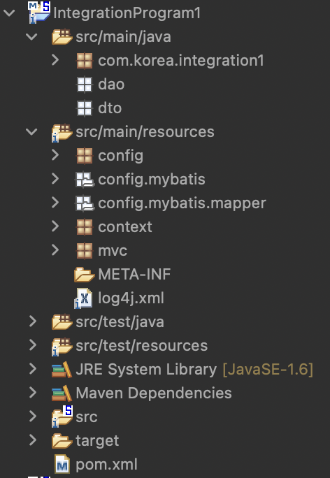

# 고객 관련 데이터를 저장하고 있는 테이블에서 원하는 정보를 입력하고 검색을 수행하는 통합 검색 프로그램을 구현하세요

## 1. 다음 개발환경을 이용하세요
1. DB : Oracle (hr 계정에 작업하세요) / Mybatis를 사용해 연결하세요
2. IDE : STS3 (Lombok은 사용하지 않아도 감점은 아닙니다)

## 2. 아래와 같은 구조를 가지는 프로젝트를 생성하세요

;
