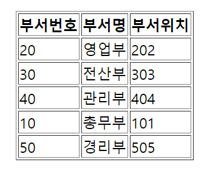

# Mybatis를 연동하여 Dept테이블을 조회하세요


## 1.IntegrationProgram1 이라는 이름으로 프로젝트를 생성하세요.
- artifactid는 dept로 합니다.
- 어노테이션 설정방식으로 프로젝트를 구성하세요
- 필요한 클래스는 Bean으로 만들어 의존성주입하세요
- pom.xml에 필요한 라이브러리를 다운로드 받으세요

### Context_1_mybatis.java
- mybatis Bean 생성은 아래의 코드를 사용하세요
```java
package context;

@Configuration
public class Context_1_mybatis {
	
	@Bean
	public DataSource ds() {
		BasicDataSource ds = new BasicDataSource();
		ds.setDriverClassName("oracle.jdbc.OracleDriver");
		ds.setUrl("jdbc:oracle:thin:@localhost:1521:xe");
		ds.setUsername("test_pm");
		ds.setPassword("1111");
		return ds;
	}
	@Bean
	public SqlSessionFactory factoryBean(DataSource ds) throws Exception{
		SqlSessionFactoryBean factoryBean = new SqlSessionFactoryBean();
		factoryBean.setDataSource(ds);
		
		//추가적인 Mybatis설정
		factoryBean.setConfigLocation(new ClassPathResource("config/mybatis/mybatis-config.xml"));
		return factoryBean.getObject();
	}
	
	
	@Bean
	public SqlSessionTemplate sqlSessionTemplate(SqlSessionFactory factoryBean) {
		return new SqlSessionTemplate(factoryBean);
	}
	
	
}
```

### Context_2_dao
- dao의 Bean객체를 만들기 위해 아래의 코드를 사용하세요
```java
package context;

import org.apache.ibatis.session.SqlSession;
import org.springframework.context.annotation.Bean;
import org.springframework.context.annotation.Configuration;

@Configuration
public class Context_2_dao {


}
```

### ServletContext.java
```java
package config;

import org.springframework.context.annotation.Bean;
import org.springframework.context.annotation.Configuration;
import org.springframework.web.servlet.config.annotation.EnableWebMvc;
import org.springframework.web.servlet.config.annotation.ResourceHandlerRegistry;
import org.springframework.web.servlet.config.annotation.WebMvcConfigurer;

import com.korea.db.DeptController;
import com.korea.db.SawonController;

import dao.DeptDAO;
import dao.SawonDAO;

@Configuration
@EnableWebMvc
public class ServletContext implements WebMvcConfigurer {

	@Override
	public void addResourceHandlers(ResourceHandlerRegistry registry) {
		registry.addResourceHandler("/resources/**").addResourceLocations("/resources/");
	}
	
//	@Bean
//	public InternalResourceViewResolver resolver() {
//		InternalResourceViewResolver resolver = new InternalResourceViewResolver();
//		resolver.setViewClass(JstlView.class);
//		resolver.setPrefix("/WEB-INF/views/");
//		resolver.setSuffix(".jsp");
//		return resolver;
//	}
	
}
```

## dto 패키지에 DeptDTO.java를 만들고 코드를 작성하세요
- 롬복은 사용하지 않아도 됩니다.
```java
package dto;

import lombok.Data;

@Data
public class DeptDTO {

	private String dname,loc;
	private int deptno;
}
```


## dao패키지에 DeptDAO.java 만들기
```java
package dao;

import java.util.List;

import org.apache.ibatis.session.SqlSession;

import vo.DeptVO;

public class DeptDAO {

	SqlSession sqlSession;

	//SqlSessionTemplate Bean은 DAO Bean에 SqlSession attribute를 사용하여 직접 주입할 수 있다.
	
	//Setter Injection
//	public void setSqlSession(SqlSession sqlSession) {
//		this.sqlSession = sqlSession;
//	}
	
	//Constructor Injection
	public DeptDAO(SqlSession sqlSession) {
		this.sqlSession = sqlSession;
	}
	
	//전체 부서 조회
	public List<DeptVO> selectList(){
		List<DeptVO> list = sqlSession.selectList("dept.dept_list");
		return list;
	}
}
```
- 코드를 작성하고 난 후 의존성 Bean객체를 생성해주세요

## 3. com.korea.dept 패키지에 DeptController 클래스 만들기
```java
package com.korea.db;

import java.util.List;

import org.springframework.stereotype.Controller;
import org.springframework.ui.Model;
import org.springframework.web.bind.annotation.RequestMapping;

import dao.DeptDAO;
import vo.DeptVO;

@Controller
public class DeptController {

	public static final String VIEW_PATH = "/WEB-INF/views/dept/";
	
	//dao에 대한 정보가 필요하기 때문에 이미 만들어놓은 정보를 주입해야 한다.
	DeptDAO dept_dao;
	
	//Constructor Injection
	public DeptController(DeptDAO dept_dao) {
		this.dept_dao = dept_dao;
	}

	//Setter Injection
//	public void setDeptDAO(DeptDAO dept_dao) {
//		this.dept_dao = dept_dao;
//	}
	
	@RequestMapping(value= {"/","list"})
	public String list(Model model) {
		List<DeptVO> list = dept_dao.selectList();
		
		model.addAttribute("list",list);
		return VIEW_PATH + "dept_list.jsp";
	}
}
```
- 코드를 작성하고 난 후 의존성 Bean객체를 생성해주세요


## 3. dept_list.jsp 생성하기
```jsp
<%@ page language="java" contentType="text/html; charset=UTF-8"
    pageEncoding="UTF-8"%>
<%@taglib prefix="c" uri="http://java.sun.com/jsp/jstl/core" %>
<!DOCTYPE html>
<html>
<head>
<meta charset="UTF-8">
<title>Insert title here</title>
</head>
<body>
	안녕하세요
	<table border = "1" align="center">
		<tr>
			<th>부서번호</th>
			<th>부서명</th>
			<th>부서위치</th>
		</tr>
		<c:forEach var="i" items="${list}">
		<tr>
			<td>${i.deptno }</td>
			<td>${i.dname }</td> 
			<td>${i.loc }</td>
		</tr>
		</c:forEach>
	</table>
</body>
</html>
```


