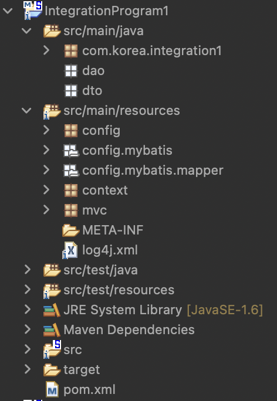
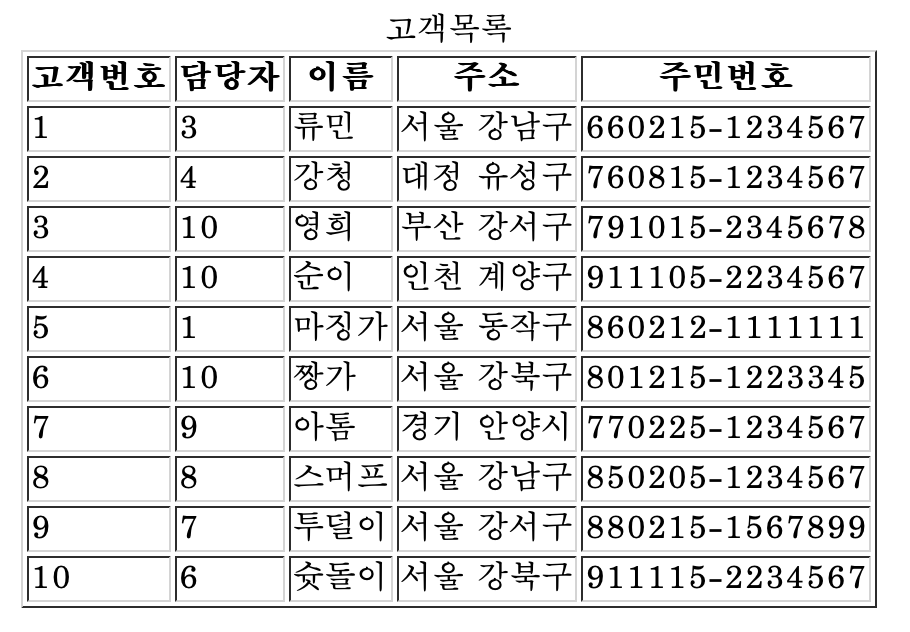
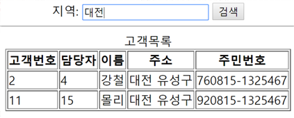

# 고객 관련 데이터를 저장하고 있는 테이블에서 원하는 정보를 입력하고 검색을 수행하는 통합 검색 프로그램을 구현하세요

## 1. 다음 개발환경을 이용하세요
1. DB : Oracle (hr 계정에 작업하세요) / Mybatis를 사용해 연결하세요
```sql
CREATE TABLE GOGEK(
	GOBUN NUMBER(3) PRIMARY KEY, --고객번호
	GONAME VARCHAR2(50), --고객 이름
	GOADDR VARCHAR2(50), --고객 주소
	GOJUMIN VARCHAR2(20), -- 주민번호
	GODAM NUMBER(3) -- 담당자 번호
);

insert into gogek values(1, '류민', '서울 강남구', '660215-1234567', 3);
insert into gogek values(2, '강청', '대전 유성구', '760815-1234567', 4);
insert into gogek values(3, '영희', '부산 강서구', '791015-2345678', 10);
insert into gogek values(4, '순이', '인천 계양구', '911105-2234567', 10);
insert into gogek values(5, '마징가', '서울 동작구', '860212-1111111', 1);
insert into gogek values(6, '짱가', '서울 강북구', '801215-1223345', 10);
insert into gogek values(7, '아톰', '경기 안양시', '770225-1234567', 9);
insert into gogek values(8, '스머프', '서울 강남구', '850205-1234567', 8);
insert into gogek values(9, '투덜이', '서울 강서구', '880215-1567899', 7);
insert into gogek values(10, '슛돌이', '서울 강북구', '911115-2234567', 6);
COMMIT;
```
2. IDE : STS3 (Lombok은 사용하지 않아도 감점은 아닙니다)

## 2. 아래와 같은 구조를 가지는 프로젝트를 생성하세요

;

## 3. 전체 고객 검색하기



### 정답
```java
/***GogekDTO***/
package dto;

public class GogekDTO {
	
	private int gobun;
	private int godam;
	private String goname;
	private String goaddr;
	private String gojumin;
	
	public int getGobun() {
		return gobun;
	}
	public void setGobun(int gobun) {
		this.gobun = gobun;
	}
	public int getGodam() {
		return godam;
	}
	public void setGodam(int godam) {
		this.godam = godam;
	}
	public String getGoname() {
		return goname;
	}
	public void setGoname(String goname) {
		this.goname = goname;
	}
	public String getGoaddr() {
		return goaddr;
	}
	public void setGoaddr(String goaddr) {
		this.goaddr = goaddr;
	}
	public String getGojumin() {
		return gojumin;
	}
	public void setGojumin(String gojumin) {
		this.gojumin = gojumin;
	}
	
	
}

/***GogekDAO***/
package dao;

import java.util.List;

import org.apache.ibatis.session.SqlSession;

import dto.GogekDTO;

public class GogekDAO {
	
	SqlSession sqlSession;
	
	//setter injection
	//public void setSqlSession(SqlSession sqlSession) {
	//	this.sqlSession = sqlSession;
	//}

	//constructor injection
	public GogekDAO(SqlSession sqlSession) {
		this.sqlSession = sqlSession;
	}
	
	public List<GogekDTO> selectAll(){
		return sqlSession.selectList("gogek.gogek_list");
	}
	
	
}

/***Context_2_dao.java***/
package context;

import org.apache.ibatis.session.SqlSession;
import org.springframework.context.annotation.Bean;
import org.springframework.context.annotation.Configuration;

import dao.GogekDAO;

//bean객체 만들어줌
@Configuration
public class Context_2_dao {
	
	@Bean
	public GogekDAO gogekDAO(SqlSession sqlSession) {
		return new GogekDAO(sqlSession);
	}

}

```

```xml
<--gogek.xml-->
<?xml version="1.0" encoding="UTF-8" ?>
<!DOCTYPE mapper
PUBLIC "-//mybatis.org//DTD Mapper 3.0//EN"
"http://mybatis.org/dtd/mybatis-3-mapper.dtd">
<mapper namespace="gogek">

	<select id="gogek_list" resultType="gogek">
		select * from gogek
	</select>


</mapper>
```
```java
/*** GogekController ***/
package com.korea.integration1;

import java.util.List;

import org.springframework.stereotype.Controller;
import org.springframework.ui.Model;
import org.springframework.web.bind.annotation.RequestMapping;

import dao.GogekDAO;
import dto.GogekDTO;

@Controller
public class GogekController {
	
	GogekDAO gogekDAO;
	
	final String path = "/WEB-INF/views/";
	
	//setter injection
	//public void setGogekDAO(GogekDAO gogekDAO) {
	//	this.gogekDAO = gogekDAO;
	//}

	//constructor injection
	public GogekController(GogekDAO gogekDAO) {
		this.gogekDAO = gogekDAO;
	}
	
	@RequestMapping(value= {"/","gogek_list"})
	public String gogekList(Model model) {
		
		List<GogekDTO> list = gogekDAO.selectAll();
		
		model.addAttribute("list",list);
		
		return path+"gogek_list.jsp";
	}
}
```
```jsp
<%@ page language="java" contentType="text/html; charset=UTF-8"
    pageEncoding="UTF-8"%>
<%@taglib prefix="c" uri="http://java.sun.com/jsp/jstl/core" %>

<html>
<head>
<meta charset="UTF-8">
<title>Insert title here</title>
</head>


<body>
	
	<table border="1" align="center">
		<caption>고객목록</caption>
		<tr>
			<th>고객번호</th>
			<th>담당자</th>
			<th>이름</th>
			<th>주소</th>
			<th>주민번호</th>
		</tr>

	
		<c:forEach var="dto" items="${list}">
			<tr>
				<td>${dto.gobun}</td>
				<td>${dto.godam}</td>
				<td>${dto.goname}</td>
				<td>${dto.goaddr}</td>
				<td>${dto.gojumin}</td>
			</tr>
		</c:forEach>
	
	
	</table>
</body>
</html>
```
### 해당 지역에 해당하는 고객만 조회하기


```jsp
<%@ page language="java" contentType="text/html; charset=UTF-8"
    pageEncoding="UTF-8"%>
<%@taglib prefix="c" uri="http://java.sun.com/jsp/jstl/core" %>

<html>
<head>
<meta charset="UTF-8">
<title>Insert title here</title>
<script>
	
	function search(){

		var search = document.getElementById("search").value.trim();
		
		if(search == ''){
			alert("지역을 입력해주세요");
			return;
		}
		location.href="gogek_search?search="+search;
	};
	
</script>
</head>


<body>
	<div align="center">
			지역:
			<input id="search" placeholder="검색어를 입력하세요">
			<input type="button" value="검색" onclick="search();"> 
	</div>
		
		<hr>
	
	<table border="1" align="center">
		<caption>고객목록</caption>
		<tr>
			<th>고객번호</th>
			<th>담당자</th>
			<th>이름</th>
			<th>주소</th>
			<th>주민번호</th>
		</tr>

	
		<c:forEach var="dto" items="${list}">
			<tr>
				<td>${dto.gobun}</td>
				<td>${dto.godam}</td>
				<td>${dto.goname}</td>
				<td>${dto.goaddr}</td>
				<td>${dto.gojumin}</td>
			</tr>
		</c:forEach>
	
	
	</table>
</body>
</html>
```

```java
package com.korea.integration1;

import java.util.List;

import org.springframework.stereotype.Controller;
import org.springframework.ui.Model;
import org.springframework.web.bind.annotation.RequestMapping;

import dao.GogekDAO;
import dto.GogekDTO;

@Controller
public class GogekController {
	
	GogekDAO gogekDAO;
	
	final String path = "/WEB-INF/views/";
	
	//setter injection
	//public void setGogekDAO(GogekDAO gogekDAO) {
	//	this.gogekDAO = gogekDAO;
	//}

	//constructor injection
	public GogekController(GogekDAO gogekDAO) {
		this.gogekDAO = gogekDAO;
	}
	
	@RequestMapping(value= {"/","gogek_list"})
	public String gogekList(Model model) {
		
		List<GogekDTO> list = gogekDAO.selectAll();
		
		model.addAttribute("list",list);
		
		return path+"gogek_list.jsp";
	}
	
	@RequestMapping("gogek_search")
	public String search(Model model, String search) {
		List<GogekDTO> list = gogekDAO.find(search);
		model.addAttribute("list",list);
		
		return path+"gogek_list.jsp";
	}

}

/*** GogekDAO.java ***/
package dao;

import java.util.List;

import org.apache.ibatis.session.SqlSession;

import dto.GogekDTO;

public class GogekDAO {
	
	SqlSession sqlSession;
	
	//setter injection
	//public void setSqlSession(SqlSession sqlSession) {
	//	this.sqlSession = sqlSession;
	//}

	//constructor injection
	public GogekDAO(SqlSession sqlSession) {
		this.sqlSession = sqlSession;
	}
	
	public List<GogekDTO> selectAll(){
		return sqlSession.selectList("gogek.gogek_list");
	}
	
	public List<GogekDTO> find(String search){
		return sqlSession.selectList("gogek.gogek_search",search);
	}
}

```

```xml
<?xml version="1.0" encoding="UTF-8" ?>
<!DOCTYPE mapper
PUBLIC "-//mybatis.org//DTD Mapper 3.0//EN"
"http://mybatis.org/dtd/mybatis-3-mapper.dtd">
<mapper namespace="gogek">

	<select id="gogek_list" resultType="gogek">
		select * from gogek
	</select>
	
	<select id="gogek_search" parameterType="String" resultType="gogek">
		select * from gogek where goaddr like '%'|| #{ search } ||'%'
	</select>
</mapper>
```

