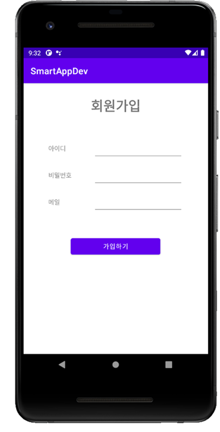

## 훈련과정명
- (스마트웹콘텐츠개발)AWS 클라우드를 활용한 풀스택 개발
## 교과목명
- 스마트문화앱 구현
## 능력단위
- 스마트문화앱 개발환경 구축

## 평가준거
### 개발플랫폼 선정하기
- 작성된 문화콘텐츠 기획서를 바탕으로 개발에 필요한 환경 및 요소를 준비 할 수 있다.
- 개발 환경에 필요한 프로그래밍 언어, 활용기기, 툴, OS를 정할 수 있다.
- 개발에 필요한 통신방법, 개발규칙, 사용자환경, 관리방법에 관한 요소를 정의할 수 있다.
### 앱 개발방법론 선정하기
- 준비된 개발 환경에 적합한 개발 방법(네이티브앱, 모바일앱, 웹앱, 하이브리드앱)을 선정할 수 있다.
- 선정된 개발 방법을 바탕으로 스마트문화앱 개발환경을 구체화 시킬 수 있다.
- 정해진 개발 방법과 구체화된 개발 환경을 바탕으로 개발을 계획할 수 있다.
### 앱 개발 계획 수립하기
- 프로젝트 기획서, 문화콘텐츠 기획안, 준비된 개발 환경과 선정된 개발 방법을 바탕으로 개발 계획을 수립할 수 있다.
- 업무분석과 사용자분석을 바탕으로 개발 계획을 수립할 수 있다.
- 개발일정, 투입인력, 소요비용, 활용장비, 적용시스템을 계획하고 선정할 수 있다.

## 채점 기준
```
<수행준거> 개발 환경에 필요한 프로그래밍 언어, 활용기기, 툴, OS를 정할 수 있다.

10점 : JDK, Android 프로젝트를 올바르게 준비한 경우

0점 : JDK, Android 프로젝트를 1개라도 잘못 준비한 경우

 

 

<수행준거> 작성된 문화콘텐츠 기획서를 바탕으로 개발에 필요한 환경 및 요소를 준비할 수 있다.

10점 : 올바른 Virtual Device를 선택한 경우

5점 : Size, Resolution, Density 중 1개를 잘못 선택한 경우

0점 : 잘못된 Virtual Device를 선택한 경우

 

 

<수행준거> 선정된 개발 방법을 바탕으로 스마트문화앱 개발환경을 구체화 시킬 수 있다.

* component, layout 확인

30점 : 제시된 화면과 90% 이상 유사한 작업을 수행한 경우

20점 : 제시된 화면과 50% 이상 유사한 작업을 수행한 경우

10점 : 제시된 화면과 50% 미만 유사한 작업을 수행한 경우

0점 : 작업을 수행하지 못한 경우

<수행준거> 정해진 개발 방법과 구체화된 개발 환경을 바탕으로 개발을 계획할 수 있다.

20점 : 정상적으로 동작하는 경우

10점 : 코드를 작성하였으나 정상적으로 동작하지 않는 경우

0점 : 작업을 수행하지 못한 경우
```

# 다음 지시에 따라 안드로이드 앱 화면을 구현하시오

## 1. React Native 0.76 이상, Android 10(API 29) 이상으로 프로젝트를 구성하시오. 프로젝트 이름은 SmartAppDev로 지정하시오.


## 2.대중적으로 사용하는 스마트폰 앱을 개발하기 위해서 Virtual Android Device로 크기 5인치, 해상도 1080x2160, DPI 440 이상의 Pixel 3장치를 이용하여 개발을 진행하시오.

## 3. 아래 화면과 같은 앱 화면을 구현하시오. layout이나 component는 화면을 참고하여 스스로 결정하시오.




## 4. 아이디와 메일을 입력한 뒤 "가입하기" 버튼을 클릭하면 아래와 같이 나타나도록 구현하시오.


* 답안제출 : 프로젝트 SmartAppDev 폴더 전체를 zip 파일로 압축하여 업로드하시오.